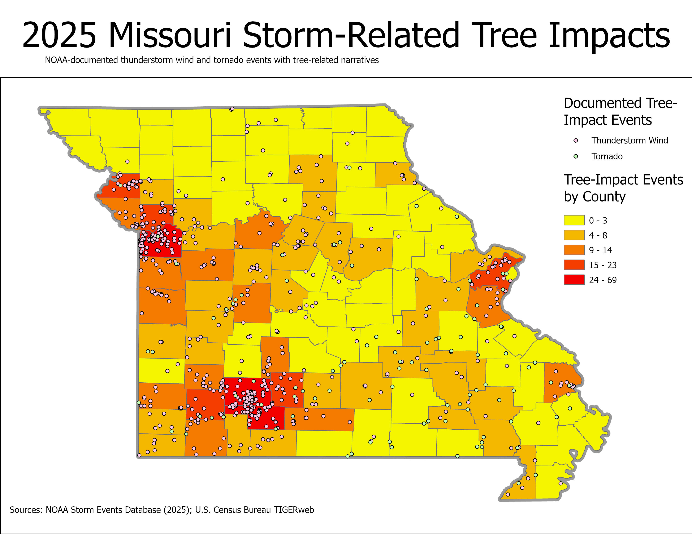
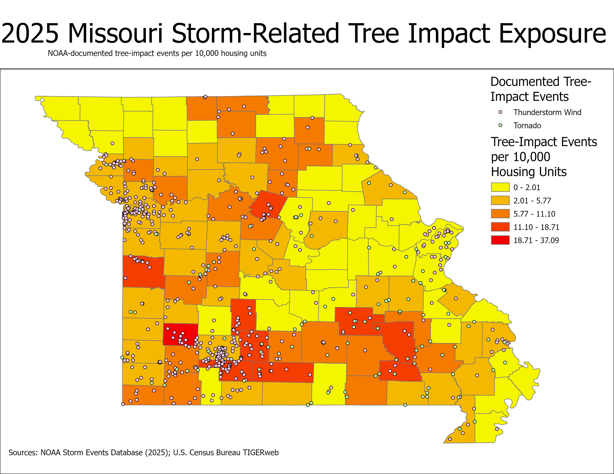

# Storm Response GIS

## Severe Weather & Tree-Impact Analysis

This project explores how GIS and Python can support storm-response operations by identifying and mapping severe-weather events associated with reported tree impacts.

The project uses publicly available NOAA Storm Events data and U.S. Census Bureau geographic data to create a reproducible workflow for identifying, processing, mapping, and analyzing storm-related tree impacts.

## Project Question

**Where were tree-related wind and tornado impacts documented in Missouri during 2025, and what geographic patterns can be identified from those events?**

## Current Results

The initial analysis processed **72,360 NOAA Storm Events records** from 2025.

The workflow identified:

- **2,757** storm events in Missouri
- **1,107** Missouri wind-related events
- **711** events with tree-related terminology in the NOAA event narrative
- **683** tree-impact events with usable geographic coordinates
- **682** events successfully spatially matched to Missouri counties

The most frequently represented counties in the spatial analysis were:

| County | Tree-Impact Events |
|---|---:|
| Jackson | 69 |
| Greene | 58 |
| Christian | 41 |
| Clay | 23 |
| St. Louis | 20 |

These values represent NOAA event records meeting the project's classification criteria and should not be interpreted as insurance claim counts or individual damaged properties.

## Housing-Normalized Exposure



Normalizing mapped tree-impact events by 2020 Census housing units changes the geographic pattern substantially. Counties with the highest raw event totals are not necessarily the counties with the highest number of mapped events relative to residential exposure.

The highest 2025 event rates were:

| County | Events | Housing Units | Events per 10,000 Housing Units |
|---|---:|---:|---:|
| Dade | 14 | 3,775 | 37.09 |
| Douglas | 10 | 5,346 | 18.71 |
| Carter | 5 | 2,675 | 18.69 |
| Bates | 12 | 7,189 | 16.69 |
| Howard | 7 | 4,368 | 16.03 |

This metric is a normalized event-exposure indicator, not a probability of property damage or an insurance-risk score.

## Methodology

### County Spatial Exposure Analysis

To avoid relying solely on NOAA's reported county/zone name, the workflow downloads Missouri county boundaries from the U.S. Census Bureau TIGERweb service and performs a point-in-polygon spatial join with GeoPandas.

Of 683 mappable tree-impact events, 682 intersected a Missouri county polygon. County event totals are then joined to 2020 Census housing-unit counts using the five-digit Census GEOID.

The normalized exposure indicator is calculated as:

**Event Rate = (Mapped Tree-Impact Events / Housing Units) × 10,000**

This metric represents the number of mapped NOAA tree-impact event records per 10,000 housing units. It is intended for comparative spatial analysis and should not be interpreted as the probability of property damage or as an insurance-risk score.

### Quality Assurance

The automated workflow includes QA checks at each major processing stage:

- 683 tree-impact events contained usable coordinates.
- 682 events spatially intersected a Missouri county polygon.
- 115 Missouri county or county-equivalent polygons were retrieved from Census TIGERweb.
- 115 county records were produced in the final exposure dataset.
- Spatial county assignments were compared against NOAA's `CZ_NAME` attribute as an additional validation step.

The spatial comparison identified cases where NOAA's reported county/zone attribution differed from the county containing the event coordinates. For this reason, the final county-level analysis uses the point-in-polygon spatial assignment rather than relying exclusively on the NOAA county-name field.

### 1. Data Acquisition

NOAA Storm Events bulk data for 2025 was used as the primary event dataset.

### 2. Geographic Filtering

The national dataset was filtered to records where:

`STATE = MISSOURI`

This reduced the dataset from **72,360** national records to **2,757** Missouri records.

### 3. Event-Type Filtering

The analysis selected storm types with the potential to produce tree impacts:

- Thunderstorm Wind
- Tornado
- High Wind
- Strong Wind

This produced **1,107** candidate events.

### 4. Tree-Impact Classification

NOAA's `EVENT_NARRATIVE` field was searched for tree-related terminology including:

- tree / trees
- branch / branches
- limb / limbs
- trunk / trunks

Events containing at least one of these terms were classified with:

`TREE_IMPACT = True`

This identified **711** events with tree-related terminology.

### 5. Coordinate Quality Control

Records without `BEGIN_LAT` or `BEGIN_LON` coordinates were excluded from point mapping.

Of the 711 classified events:

- **683** contained usable starting coordinates
- **28** lacked usable starting coordinates

### 6. Spatial Data Creation

GeoPandas was used to convert the filtered records into point geometries using:

`BEGIN_LON` and `BEGIN_LAT`

The resulting GeoDataFrame uses:

`EPSG:4326 — WGS 84`

The processed spatial dataset was exported as a GeoPackage for use in desktop GIS software.

### 7. County Spatial Analysis

Missouri county boundaries from the U.S. Census Bureau TIGERweb service were used for county-level analysis.

ArcGIS Pro Spatial Join was used to aggregate the NOAA point features to Missouri counties.

Of the **683** geocoded events, **682** intersected a Missouri county polygon.

One tornado event located along the Missouri state border did not intersect a Missouri county polygon and was retained in the source dataset but excluded from county aggregation.

This record was:

- NOAA Event ID: `1255585`
- Event Type: Tornado
- NOAA County/Zone: Jasper
- Latitude: `37.1297`
- Longitude: `-94.618`

No attempt was made to manually move or alter the source coordinates.

## Reproducible Workflow

```text
NOAA Storm Events CSV
        ↓
Filter to Missouri
        ↓
Select Wind-Related Events
        ↓
Search Event Narratives
        ↓
Identify Tree-Impact Records
        ↓
Remove Records Without Coordinates
        ↓
Create GeoPandas Point Geometry
        ↓
Export GeoPackage
        ↓
Spatial Join to Missouri Counties
        ↓
Map & Analyze Geographic Patterns
```

## Technologies

- Python
- pandas
- GeoPandas
- Requests
- REST APIs
- ArcGIS Pro
- Spatial Join
- NOAA Storm Events Database
- U.S. Census Bureau Decennial Census
- U.S. Census Bureau TIGERweb
- GeoPackage
- Git / GitHub

## Repository Structure

```text
storm-response-gis/
│
├── README.md
├── .gitignore
│
├── data/
│   ├── raw/
│   └── processed/        # Generated locally; ignored by Git
│
├── images/
│   ├── missouri_tree_impacts_2025.jpg
│   └── missouri_tree_impact_exposure_2025.jpg
│
└── src/
    └── process_storm_data.py

The `data/processed/` directory is generated by the Python workflow and is excluded from version control. Census API credentials are stored locally in `census_api_key.txt`, which is also excluded through `.gitignore`.
```

### `src/process_storm_data.py`

The Python processing script automatically:

The Python processing script automatically:

1. Locates and loads the NOAA Storm Events source data.
2. Filters the national dataset to Missouri.
3. Selects wind-related storm event types.
4. Searches NOAA event narratives for tree-impact terminology.
5. Removes records without usable geographic coordinates.
6. Creates point geometries with GeoPandas in WGS 84 (`EPSG:4326`).
7. Exports the processed storm-event points to a GeoPackage.
8. Requests 2020 county housing-unit data from the U.S. Census API.
9. Downloads Missouri county polygons from Census TIGERweb.
10. Performs a point-in-polygon spatial join between storm events and counties.
11. Aggregates spatially matched events by county GEOID.
12. Joins county event counts to Census housing-unit data.
13. Calculates mapped tree-impact events per 10,000 housing units.
14. Exports the final county-level exposure table.
15. Prints a QA summary for reproducibility checks.

## Data Quality & Limitations

This analysis identifies NOAA event narratives containing selected tree-related terminology. A positive classification indicates that the narrative contains those terms; it does **not** necessarily indicate damage to an insured property or represent an individual insurance claim.

NOAA property-damage values also contain missing observations. Missing damage estimates are preserved as unknown rather than being interpreted as zero damage.

Event coordinates represent locations reported in the NOAA Storm Events dataset and may not represent the full geographic extent of an event.

## Next Steps

Planned development includes:

## Next Steps

Planned development includes:

- Incorporate reported NOAA property-damage estimates
- Add tree-canopy or land-cover data
- Develop a transparent storm-response priority index
- Expand the analysis to multiple years
- Compare temporal patterns in severe-weather exposure
- Create additional publication-quality maps
- Develop an interactive web GIS application

## Project Logbook

Development progress and work-session notes are documented in the [Project Logbook](LOGBOOK.md).
## Disclaimer

This is an independent GIS portfolio project created for educational and professional-development purposes.

The project uses publicly available government data and does not contain proprietary company information, customer information, insurance claims, contractor information, or other confidential data.

## Author

**Allie Potter**  
GIS Analyst | Geospatial Developer
